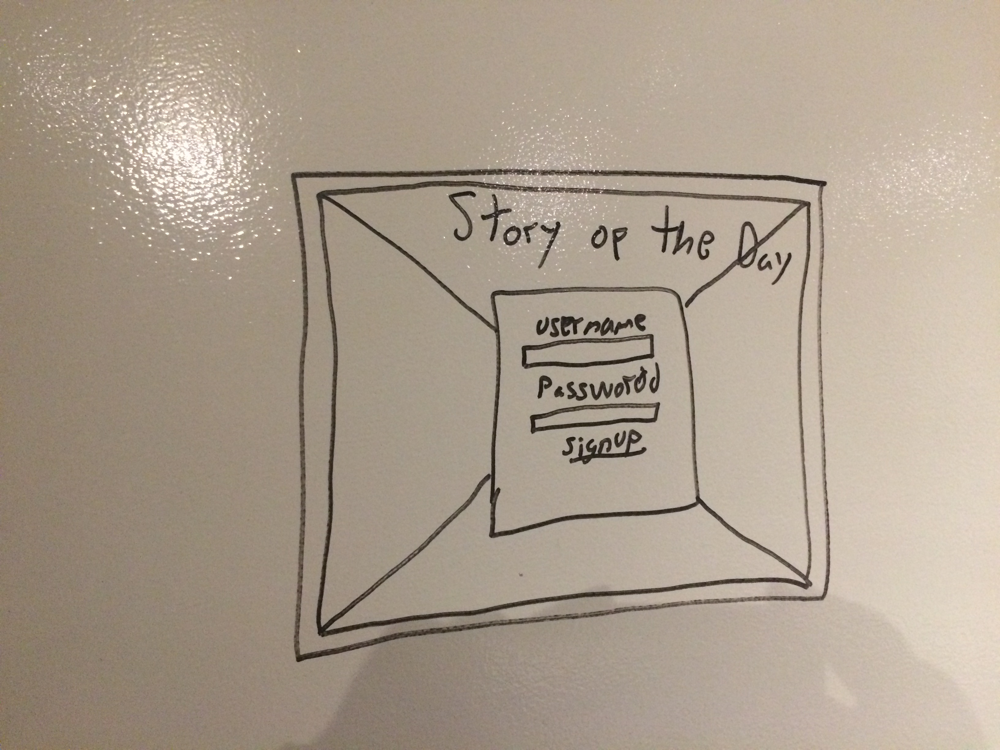
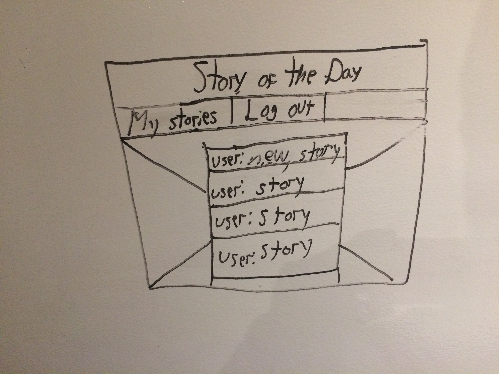
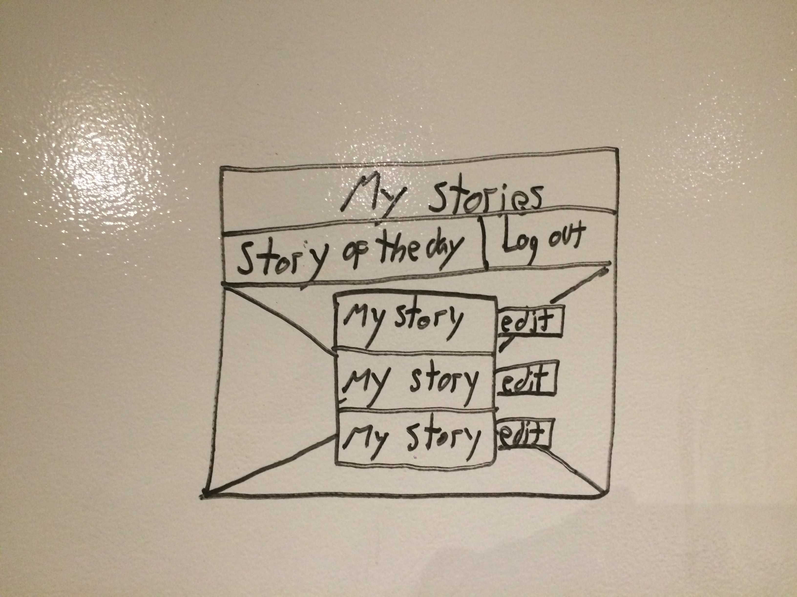
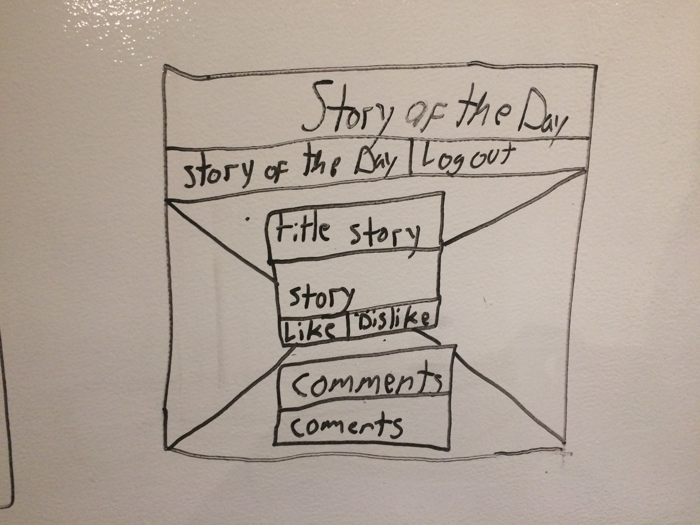
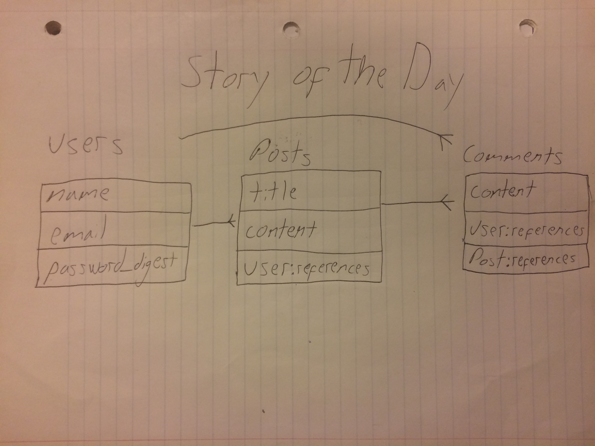

# Story of the Day

Story of the Day is a wensite where people can create their own accounts and post their story in the website and will be able to read all the other user Stories of the Day that are posted.

##Deploy instructions

To use the app just click on hte link of the top or another link on the bottom.

##Approach

##MVP
* Sign up and sign in
* Post new Story of the Day
* Erase story of the Day
* Edit story of th Day
* Check your profile stories of the Day

##Strech Goals
* Being able for other users to comment on other users stories
* Like or dislike button for the sotries of the day.
* being able to see all stories from other users.

##Technologies used
* Ruby on Rails
* HTML
* CSS/ Bootstrap 

##Unsolved problems
* you shall not pass notice 
* putting spaces between paragraphs

##Wrieframes

##Links

* [Trello](https://trello.com/b/Dfe71iIC/project-2)
* [Story of the Day app](https://daystory.herokuapp.com/)
